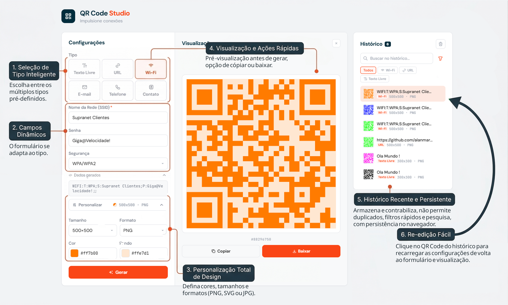
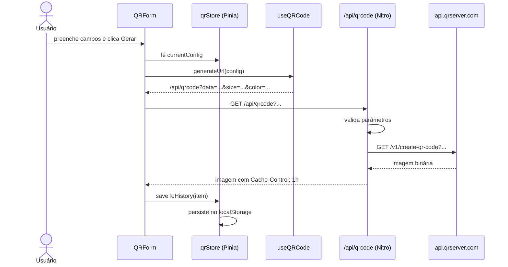

# QR Code Studio - Teste para desenvolvedor | Supranet



## Arquitetura e decisões técnicas

A aplicação é uma SPA Nuxt 4 sem `/pages` — `app.vue` é o root único, com três componentes principais orquestrados diretamente: `QRForm`, `QRPreview` e `QRHistory`.

**Decisões relevantes:**

- **Pinia** gerencia o estado global (`currentConfig`, `history`, `notification`), evitando prop drilling entre os componentes e centralizando a persistência no `localStorage`
- **Proxy server-side** (`server/api/qrcode.get.ts`) encapsula o acesso à API externa, permitindo validação de parâmetros no servidor e evitando expor a URL da API diretamente no cliente. Também adiciona cache de 1h via `Cache-Control`
- **Composable `useQRCode`** isola a lógica de montagem da URL, separando apresentação de lógica de negócio
- **Composable `useQRTemplates`** centraliza a definição dos 6 templates (campos, formatação, validação e ícones), tornando fácil adicionar novos tipos sem alterar componentes
- **SSR safety** — acessos ao `localStorage` são guardados com `import.meta.client` para evitar erros no servidor

## Integração com a API goQR.me

A chamada à API nunca é feita diretamente do browser. O fluxo completo:



O proxy valida: presença do campo `data`, tamanho máximo de 900 caracteres, formato (`png`, `jpg`, `svg`, etc.) e padrão do tamanho (`NxN`). Erros são propagados com status HTTP adequado e exibidos via toast ao usuário.

## Funcionalidades do teste

- **Geração de QR Code** a partir de texto livre ou URL via API goQR.me
- **Configurações**: tamanho em pixels, cor do QR, cor de fundo e formato (PNG, SVG, JPEG)
- **Download** da imagem gerada
- **Histórico** dos últimos QR Codes gerados com miniatura, conteúdo e configurações
- **Recarregamento** de configurações ao clicar em item do histórico
- **Persistência** do histórico via `localStorage`
- **Proxy server-side** em `server/api/qrcode.get.ts` encapsulando o acesso à API externa
- **Mensagens de erro** amigáveis para falhas ou parâmetros inválidos
- **Layout responsivo** para desktop, tablet e mobile
- **Componentização** (formulário, preview, histórico, notificações)

## Funcionalidades adicionadas no refinamento
- **6 templates** de QR Code: Texto livre, URL, Wi-Fi, E-mail, Telefone e vCard
- **Color picker** customizado com swatch clicável e campo hex editável
- **Live preview** enquanto o usuário digita
- **Copiar** o QR Code diretamente para a área de transferência
- **Busca** no histórico por texto ou ID do QR Code
- **Filtro** por tipo de template no histórico
- **Deduplicação automática** de entradas no histórico
- **Scroll automático** até o preview no mobile após gerar
- **Notificações toast** para todas as ações (sucesso, erro e informativo)

## Como rodar

### Com Docker (recomendado)

```bash
# Clone o repositório
git clone https://github.com/alanmartinsdeazevedo/teste_dev_supra.git
cd teste_dev_supra

# Build da imagem
docker build -t qr-code-studio .

# Rodar o container
docker run -p 3000:3000 qr-code-studio
```

Acesse em **http://localhost:3000**

### Com Docker Compose

```bash
docker compose up
```

### Localmente

```bash
# Com Bun
bun install
bun run dev

# Com npm
npm install
npm run dev
```

> A aplicação não requer variáveis de ambiente. A API do goQR.me é pública e acessada via proxy interno.
